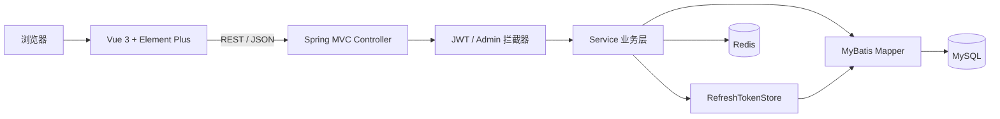
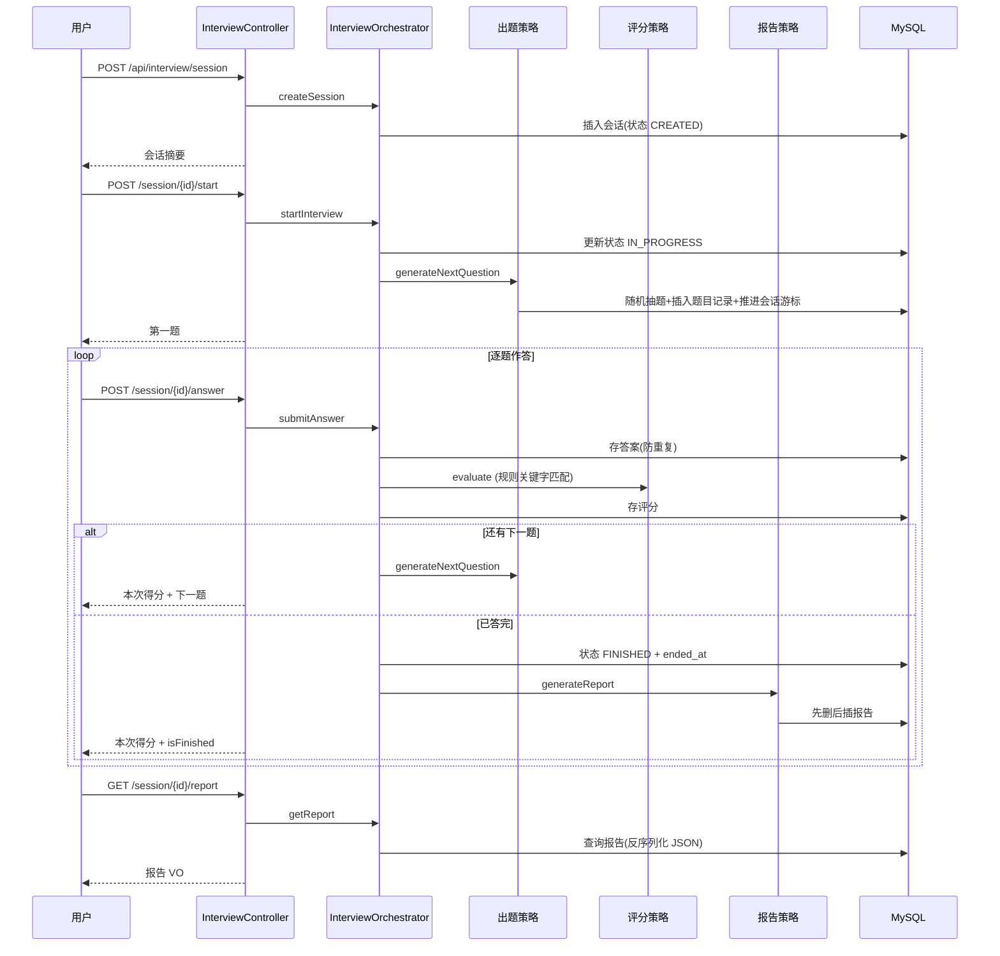
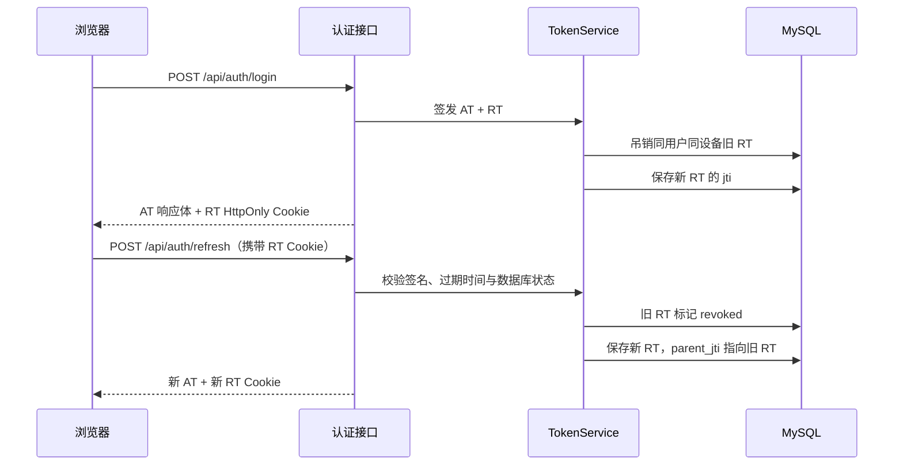
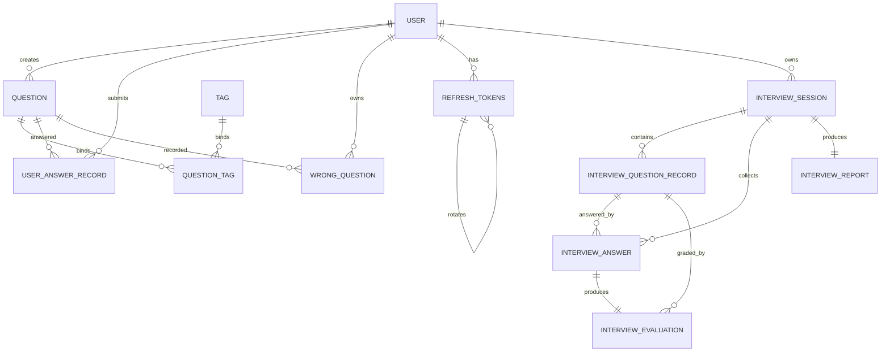

# Java AI Interview Agent

一个面向 Java 技术面试场景的前后端分离题库与刷题后台。目前已经完成用户、题目、标签、答题提交、答题记录、错题本、练习统计、权限控制以及双 JWT 会话管理，用户侧已具备基础的刷题闭环（答题 → 记录 → 错题本 → 统计），并新增**规则版模拟面试模块**（发起面试 → 逐题作答 → 即时关键词评分 → 生成面试报告），可作为后续接入 AI 模拟面试、智能评分和面试报告的业务底座。

> 当前版本暂未接入大模型。模拟面试的评分与报告生成基于规则（标准答案关键句命中率），不调用任何外部 AI 接口；普通答题判分仅做标准答案回显与占位逻辑，错题暂不自动累积，预留为接入 AI 评分后的自动收集入口。项目名称中的 AI Interview Agent 属于后续规划，不把未完成能力描述为已实现功能。

## 目录

- [项目介绍](#项目介绍)
- [技术栈](#技术栈)
- [功能模块](#功能模块)
- [系统架构](#系统架构)
- [数据库设计](#数据库设计)
- [核心接口](#核心接口)
- [启动方式](#启动方式)
- [演示与压测](#演示与压测)
- [项目亮点](#项目亮点)
- [后续计划](#后续计划)

## 项目介绍

本项目用于搭建 Java 面试学习与管理平台，区分普通用户和管理员两类角色：

- **普通用户**：注册登录、浏览题库、按条件筛选题目、查看题目详情、提交答题、查看答题历史、错题本复习、查看练习统计、发起模拟面试并获取逐题评分与面试报告、维护个人资料和修改密码。
- **管理员**：查看数据概览，管理用户、题目和标签，重置用户密码、禁用用户以及吊销用户会话。
- **系统基础能力**：答题记录、错题累计、练习统计、逻辑删除、双令牌认证和 Refresh Token 轮换。

题目类型统一为以下四类：

- 八股题
- 场景题
- 项目题
- 算法题

## 技术栈

### 后端

| 技术 | 版本 | 用途 |
| --- | --- | --- |
| Java | 17 | 后端开发语言 |
| Spring Boot | 3.5.16 | Web 应用基础框架 |
| Spring MVC | Spring Boot 管理 | REST API 与 MVC 拦截器 |
| MyBatis | 3.0.5 | 数据访问与 XML SQL 映射 |
| MySQL | 8.x 推荐 | 业务数据与 Refresh Token 持久化 |
| Redis | 7.x+ | 登录 token 缓存、题目详情缓存、热门题缓存、练习统计缓存、登录限流与重复提交锁 |
| JJWT | 0.12.6 | Access Token、Refresh Token 签发与解析 |
| Spring Security Crypto | Spring Boot 管理 | BCrypt 密码加密，不使用完整 Security Filter Chain |
| Lombok | Spring Boot 管理 | 减少实体与 DTO 样板代码 |
| Maven Wrapper | 项目内置 | 构建、测试与启动后端 |

### 前端

| 技术 | 版本范围 | 用途 |
| --- | --- | --- |
| Vue | `^3.5.0` | 前端框架 |
| Vite | `^5.4.0` | 开发服务器与生产构建 |
| Vue Router | `^4.4.0` | 路由与页面权限控制 |
| Pinia | `^2.2.0` | 登录状态和菜单状态管理 |
| Axios | `^1.7.0` | HTTP 请求、令牌刷新与请求重放 |
| Element Plus | `^2.14.3` | UI 组件库 |
| Element Plus Icons Vue | `^2.3.2` | 图标组件 |

## 功能模块

### 1. 用户与权限

- 用户注册和登录
- BCrypt 密码哈希存储与校验
- 用户信息查询、分页、更新和逻辑删除
- 普通用户修改个人资料和密码
- 管理员创建、编辑、禁用和删除用户
- 管理员重置用户密码
- `USER`、`ADMIN` 两级角色控制
- 前端路由守卫与后端接口权限双重校验

### 2. 双令牌认证

- Access Token 默认有效期 15 分钟
- Refresh Token 默认有效期 7 天
- Access Token 使用 `Authorization: Bearer <token>` 传递
- Refresh Token 使用 `HttpOnly Cookie` 传递，不暴露给 JavaScript
- Refresh Token 元数据持久化到 MySQL
- Refresh Token 轮换及 `parent_jti` 令牌链
- 刷新宽限期，容忍短时间网络重传
- 超出宽限期的旧令牌复用检测
- 检测到重放后吊销用户全部有效 Refresh Token
- 同一用户、同一设备重新登录时自动挤掉旧会话
- 退出登录、修改密码和管理员操作均可主动吊销会话
- 前端合并并发 401，只执行一次刷新，其余请求等待后重放

### 3. 题库管理

- 题目新增、查询、编辑和逻辑删除
- 按关键词、难度、题型和标签组合筛选
- 分页查询和每页数量限制
- 浏览次数、提交次数、正确次数统计
- 题目新增或编辑时整体维护标签集合
- 批量加载题目标签，避免逐题查询产生 N+1 问题
- Cache Aside 缓存题目详情，动态计数仍从 MySQL 实时读取
- 不存在的题目使用短 TTL 空值缓存，正常缓存使用随机 TTL 抖动
- 题目或标签更新后主动删除相关缓存
- 缓存首页热门题列表，并使用 Redis ZSet 累计题目访问热度
- 缓存用户练习总览统计，提交答案后主动失效
- 使用短 TTL Redis 锁防止同一用户短时间内重复提交同一道题
- 兼容已确认语义的历史题型值

登录接口按“用户名 + 客户端 IP”记录失败次数。Redis Lua 脚本原子执行 `INCR + PEXPIRE`，默认 5 分钟内失败 5 次后返回 HTTP 429；登录成功会清除计数。

### 4. 标签管理

- 标签新增、查询、编辑和逻辑删除
- 标签分类
- 题目与标签多对多关联
- 题目标签绑定与整体替换

### 5. 答题记录与错题

后端已经具备以下接口：

- 提交答题记录（当前不接入 AI，仅保存用户答案并回显标准答案与解析）
- 分页查询当前登录用户的历史答题记录
- 答题后更新题目提交次数和正确次数
- 错答时支持写入错题记录，同一用户再次答错同一题时累加错误次数
- 错题本分页查询（带回题目信息），未掌握题目优先展示
- 标记错题为已掌握 / 取消掌握，以及物理移除错题
- 随机抽取一道错题的完整详情，用于错题再练

> 用户身份统一由认证拦截器注入的 `authUserId` 提供，答题与错题接口不信任客户端传入的 `userId`。

### 6. 练习统计

基于当前登录用户的答题记录提供个人统计：

- 练习总览：总答题数、正确率、错题本数、平均分
- 分类统计：按标签分类（`tag.category`）分组的答题数与正确率
- 薄弱标签：默认前 5 个错误最多的标签
- 每日趋势：默认最近 30 天的练习量（缺失日期不补 0）

### 7. 模拟面试（规则版，无 AI）

完整模拟面试闭环，全部判分与报告生成基于规则，不调用任何外部 AI 接口：

- 发起面试会话：选择岗位、难度（简单/中等/困难）、题数（默认 5，上限 20），状态置为 `CREATED`
- 开始面试：状态 `CREATED → IN_PROGRESS`，由出题策略从题库随机抽取符合难度、本场未出过的上架题目
- 题目内容快照：出题时把 `question.content` 复制到 `interview_question_record.question_content`，防止题库后续修改影响面试记录
- 逐题作答：提交回答后即时规则评分，返回本次得分、等级、命中/缺失得分点与改进建议，并给出下一题
- 重复提交防护：同一题目记录只接受一次回答
- 完成面试：答完最后一题，状态 `IN_PROGRESS → FINISHED`，生成面试报告
- 面试报告：总体均分、各维度（题型/能力）得分、总结评语、学习建议
- 状态流转约束：只有 `CREATED` 才能 `start`，只有 `IN_PROGRESS` 才能提交回答，`FINISHED` 后不可再操作

**评分规则（RuleBasedAnswerEvaluator）**：将标准答案按中文标点（。！？；）切分为关键句，统计用户回答命中的关键句数量；命中率映射为百分制得分与等级（≥80 优秀、≥60 良好、≥40 一般、<40 较差）。关键句直接被包含即命中，否则取其核心词（长度 ≥ 2）按多数（≥60%）包含判定。

**报告生成（RuleBasedInterviewReportGenerator）**：总体得分 = 各题得分均值；按题目题型/能力汇总维度得分；依据总分区间生成总结评语；从各题缺失得分点中提取高频知识点组合为学习建议；维度得分与建议用 Jackson 序列化为 JSON 持久化，`session_id` 唯一，更新采用「先删后插」。

**编排与事务**：核心流程由 `InterviewOrchestrator` 串联出题策略、评分策略、报告策略，所有写多表的方法加 `@Transactional` 保证原子性（主类已启用 `@EnableTransactionManagement`）。出题策略、评分策略、报告策略均以接口 + 规则实现的形式组织在 `interview/` 包下，后续接入 AI 只需新增对应实现并切换。

### 8. 前端页面

| 路由 | 页面 | 访问角色 |
| --- | --- | --- |
| `/login` | 登录 | 公开 |
| `/register` | 注册 | 公开 |
| `/questions` | 题库列表 | 已登录用户 |
| `/questions/:id` | 题目详情（含答题提交） | 已登录用户 |
| `/answer-records` | 答题记录 | 已登录用户 |
| `/wrong-book` | 错题本 | 已登录用户 |
| `/statistics` | 练习统计 | 已登录用户 |
| `/interview` | 模拟面试（列表 + 发起面试） | 已登录用户 |
| `/interview/:id` | 模拟面试作答（逐题评分反馈） | 已登录用户 |
| `/interview/:id/report` | 面试报告（总分/维度/建议） | 已登录用户 |
| `/profile` | 个人中心 | 已登录用户 |
| `/admin/dashboard` | 数据概览 | 管理员 |
| `/admin/questions` | 题库管理 | 管理员 |
| `/admin/tags` | 标签管理 | 管理员 |
| `/admin/users` | 用户管理 | 管理员 |

### 9. 接口文档

接入 springdoc-openapi + Knife4j，提供两套等价 UI：

- `/doc.html` —— Knife4j 文档 UI（推荐）
- `/swagger-ui/index.html` —— springdoc 自带 Swagger UI

两套 UI 共用 `/v3/api-docs` 接口定义，文档接口全程放行，在线调试需在 UI 内手动填入 Bearer Access Token。

## 系统架构

### 总体架构



### 后端分层

```text
src/main/java/com/example/interviewagent
├─ common       # 统一响应、分页结果
├─ config       # Bean、JWT 属性、MVC 拦截器注册
├─ controller   # REST API 与请求/响应 DTO
├─ domain       # 题型等领域规则
├─ entity       # 数据库实体
├─ exception    # 业务异常与全局异常处理
├─ mapper       # MyBatis Mapper 接口
├─ redis        # 题目缓存/排行与登录限流
├─ security     # JWT、Cookie、认证与管理员拦截器
├─ service      # 业务接口与实现
├─ interview    # 模拟面试策略包（出题/评分/报告接口与规则实现、流程编排器）
└─ store        # Refresh Token 存储抽象及 MySQL 实现
```

主要调用方向：

```text
Controller → Service / ServiceImpl → Mapper / Store → MySQL
Controller → Service / Redis Service → Redis
Controller(Interview) → InterviewOrchestrator → 出题/评分/报告策略 → Mapper → MySQL
```

Refresh Token 单独抽象为 `RefreshTokenStore`，令牌业务不直接依赖 MyBatis Mapper，后续可替换为 Redis 等存储实现。

### 权限架构

系统使用 Spring MVC `HandlerInterceptor` 实现认证和权限控制：

- `JwtAuthInterceptor`：校验一般业务接口的 Access Token。
- `AdminAuthInterceptor`：保护 `/api/admin/**` 管理员接口。
- `AdminWriteAuthInterceptor`：题目和标签允许已登录用户读取，但新增、编辑和删除只允许管理员执行。

前端 Vue Router 根据登录状态与角色控制页面入口；后端拦截器负责最终权限边界，不能仅通过隐藏菜单代替服务端鉴权。

### 模拟面试流程



### 令牌刷新流程



## 数据库设计

系统核心数据关系如下：



### `user` 用户表

| 主要字段 | 说明 |
| --- | --- |
| `id` | 用户主键 |
| `username` | 登录用户名 |
| `password_hash` | BCrypt 密码哈希 |
| `nickname` | 昵称 |
| `avatar_url` | 头像地址 |
| `role` | `USER` 或 `ADMIN` |
| `status` | 用户状态 |
| `deleted` | 逻辑删除标记 |
| `created_at` / `updated_at` | 创建与更新时间 |

### `question` 题目表

| 主要字段 | 说明 |
| --- | --- |
| `id` | 题目主键 |
| `title` / `content` | 标题与内容 |
| `question_type` | 八股题、场景题、项目题或算法题 |
| `difficulty` | 难度等级 |
| `answer` / `answer_analysis` | 参考答案与答案解析 |
| `source` | 题目来源 |
| `view_count` | 浏览次数 |
| `submit_count` / `correct_count` | 提交次数与正确次数 |
| `status` | 上架状态 |
| `created_by` | 创建用户 |
| `deleted` | 逻辑删除标记 |

### `tag` 标签表

| 主要字段 | 说明 |
| --- | --- |
| `id` | 标签主键 |
| `name` | 标签名称 |
| `category` | 标签分类 |
| `deleted` | 逻辑删除标记 |

### `question_tag` 题目标签关联表

用于建立题目和标签之间的多对多关系：

```text
question 1 ── N question_tag N ── 1 tag
```

建议对 `(question_id, tag_id)` 建立唯一索引，防止重复绑定。

### `answer_record` 答题记录表

| 主要字段 | 说明 |
| --- | --- |
| `user_id` / `question_id` | 用户和题目 |
| `user_answer` | 用户答案 |
| `is_correct` | 是否正确 |
| `score` | 得分 |
| `time_cost_seconds` | 答题耗时 |
| `answer_source` | 答题来源，默认 `PRACTICE` |
| `created_at` | 答题时间 |

### `wrong_question` 错题表

记录用户错题、累计错误次数、最后错误时间和是否已掌握。建议对 `(user_id, question_id)` 建立唯一索引，以配合 `ON DUPLICATE KEY UPDATE` 累加错误次数。

### `refresh_tokens` 刷新令牌表

该表不保存完整 Refresh Token，只保存服务端控制会话所需的元数据：

| 字段 | 说明 |
| --- | --- |
| `user_id` | 所属用户 |
| `device_id` | 设备标识 |
| `jti` | Refresh Token 唯一标识 |
| `parent_jti` | 上一枚 Refresh Token 的 jti，形成轮换链 |
| `expires_at` | 过期时间 |
| `revoked_at` | 吊销时间，`NULL` 表示尚未吊销 |
| `created_at` | 创建时间 |

推荐索引：

- `UNIQUE (jti)`
- `INDEX (parent_jti)`
- `INDEX (user_id)`
- `INDEX (user_id, device_id)`

### 模拟面试相关表（`interview_*`）

规则版模拟面试模块共 5 张表，建表脚本见 `sql/interview.sql`（全部 `IF NOT EXISTS`，可重复执行）：

- `interview_session`：面试会话。核心字段 `user_id`、`position`、`difficulty`（简单/中等/困难）、`status`（CREATED/IN_PROGRESS/FINISHED/CANCELLED）、`total_question_count`、`current_question_index`、`started_at`、`ended_at`。
- `interview_question_record`：面试题目记录。`question_id` 关联题库，`question_content` 为出题时的题目内容快照，`competency` 记录考察能力/题型，`sort_order` 为题目顺序，`source_type`（QUESTION_BANK/RULE/AI）。
- `interview_answer`：面试答案。一个 `question_record_id` 至多一条记录，用于防止重复提交。
- `interview_evaluation`：面试评分。`score`（0-100）、`level`（优秀/良好/一般/较差）、`matched_points`/`missing_points`（换行分隔的关键句）、`suggestion`、`evaluator_type`（RULE/AI/MANUAL）。
- `interview_report`：面试报告。`overall_score`、`summary`、`dimension_scores_json`/`suggestions_json`（JSON）、`generator_type`，`session_id` 唯一（`uk_session_id`）。

### 数据迁移脚本

`docs/migrations/` 目前包含：

- 题目类型规范化脚本
- 逻辑删除题目的历史数据清理脚本
- 无效或过期 Refresh Token 清理脚本
- 模拟面试题目、答案和评分唯一约束脚本

> 当前仓库尚未提供完整的数据库初始化 DDL。首次部署前需要创建 `interview_agent` 数据库及上述业务表，后续计划引入 Flyway 或 Liquibase 管理完整表结构和版本迁移。

## 核心接口

除公开认证接口外，请求通常需要携带：

```http
Authorization: Bearer <access-token>
```

Refresh Token 由名为 `refresh_token` 的 HttpOnly Cookie 自动携带。

统一成功响应格式：

```json
{
  "code": 0,
  "message": "success",
  "data": {}
}
```

### 认证接口

| 方法 | 路径 | 鉴权 | 说明 |
| --- | --- | --- | --- |
| POST | `/api/auth/register` | 公开 | 注册用户 |
| POST | `/api/auth/login` | 公开 | 登录，返回 AT 并设置 RT Cookie |
| POST | `/api/auth/refresh` | RT Cookie | 轮换 Refresh Token 并返回新 AT |
| POST | `/api/auth/logout` | RT Cookie | 吊销当前会话并清除 Cookie |
| POST | `/api/auth/change-password` | 已登录 | 修改当前用户密码并吊销现有会话 |

登录可携带设备标识：

```http
X-Device-Id: browser-or-device-id
```

未提供时默认为 `default`。同一用户使用相同设备标识重新登录时，旧 Refresh Token 会被吊销。

### 题目接口

| 方法 | 路径 | 权限 | 说明 |
| --- | --- | --- | --- |
| GET | `/api/questions` | 已登录 | 分页和组合筛选题目 |
| GET | `/api/questions/hot?limit=10` | 已登录 | 查询 Redis 访问热度前 N 的题目（最大 50） |
| GET | `/api/questions/{id}` | 已登录 | 查看题目详情并增加浏览次数 |
| POST | `/api/questions` | 管理员 | 创建题目 |
| PUT | `/api/questions/{id}` | 管理员 | 更新题目和标签集合 |
| DELETE | `/api/questions/{id}` | 管理员 | 逻辑删除题目 |
| GET | `/api/questions/{id}/tags` | 已登录 | 查询题目标签 |
| POST | `/api/questions/{id}/tags/{tagId}` | 管理员 | 绑定标签 |

题目分页支持：

```text
keyword、difficulty、questionType、tagId、pageNum、pageSize
```

### 标签接口

| 方法 | 路径 | 权限 | 说明 |
| --- | --- | --- | --- |
| GET | `/api/tags` | 已登录 | 查询标签列表 |
| GET | `/api/tags/{id}` | 已登录 | 查询标签详情 |
| POST | `/api/tags` | 管理员 | 创建标签 |
| PUT | `/api/tags/{id}` | 管理员 | 更新标签 |
| DELETE | `/api/tags/{id}` | 管理员 | 逻辑删除标签 |

### 用户与管理接口

| 方法 | 路径 | 权限 | 说明 |
| --- | --- | --- | --- |
| GET | `/api/users` | 已登录 | 分页查询用户 |
| GET | `/api/users/{id}` | 已登录 | 查询用户详情 |
| POST | `/api/users` | 管理员 | 创建用户 |
| PUT | `/api/users/{id}` | 本人或管理员 | 更新用户；普通用户不能修改角色和状态 |
| DELETE | `/api/users/{id}` | 本人或管理员 | 逻辑删除用户 |
| POST | `/api/admin/revoke/{userId}` | 管理员 | 吊销指定用户全部有效 RT |

### 答题与错题接口

| 方法 | 路径 | 说明 |
| --- | --- | --- |
| POST | `/api/answer/submit` | 提交答题记录（不接入 AI，仅保存并回显标准答案/解析） |
| GET | `/api/answer/records` | 分页查询当前登录用户的答题记录 |
| GET | `/api/wrong/page` | 分页查询当前用户错题（带回题目信息） |
| DELETE | `/api/wrong/{questionId}` | 物理移除错题 |
| PUT | `/api/wrong/{questionId}/mastered` | 标记已掌握 / 取消掌握 |
| GET | `/api/wrong/random` | 随机获取一道错题的完整详情 |

### 练习统计接口

| 方法 | 路径 | 说明 |
| --- | --- | --- |
| GET | `/api/stat/overview` | 练习总览（总答题/正确率/错题数/平均分） |
| GET | `/api/stat/category` | 按标签分类的答题统计 |
| GET | `/api/stat/weak-tags` | 薄弱标签列表（默认前 5） |
| GET | `/api/stat/daily` | 每日练习趋势（默认最近 30 天） |

### 模拟面试接口

| 方法 | 路径 | 说明 |
| --- | --- | --- |
| POST | `/api/interview/session` | 创建面试会话（岗位、难度、题数），状态 CREATED |
| POST | `/api/interview/session/{sessionId}/start` | 开始面试，置 IN_PROGRESS 并返回第一题 |
| GET | `/api/interview/session/{sessionId}/current-question` | 获取当前题目（不推进流程） |
| POST | `/api/interview/session/{sessionId}/answer` | 提交回答：即时规则评分，返回得分/等级/命中缺失点/建议及下一题，或标记面试完成 |
| GET | `/api/interview/session/{sessionId}/report` | 获取面试报告（直接查询，不重新生成） |
| GET | `/api/interview/sessions` | 列出当前用户全部面试历史 |

创建面试入参 `InterviewCreateDTO`：

```json
{ "position": "Java后端实习生", "difficulty": "中等", "totalQuestionCount": 5 }
```

提交回答入参 `InterviewAnswerSubmitDTO`：

```json
{ "questionRecordId": 123, "answerContent": "...", "durationSeconds": 120 }
```

> 模拟面试接口同样从认证拦截器注入的 `authUserId` 获取当前用户，校验会话归属；事故码沿用 400（参数/无题）、404（资源不存在）、409（状态冲突）。题库需有对应难度、未逻辑删除的上架题目，否则出题抛 400「题库中无符合条件的题目」。

> 答题、错题和统计接口均从认证拦截器注入的 `authUserId` 获取当前用户，不信任客户端传入的 `userId`。

## 启动方式

### 1. 环境要求

- JDK 17
- MySQL 8.x
- Redis 7.x 或更高版本
- Node.js 与 npm，建议使用能够运行 Vite 5 的活跃 LTS 版本
- Git

项目内置 Maven Wrapper，不要求全局安装 Maven。

### 2. 克隆项目

```bash
git clone https://github.com/Glorylife123/java-ai-interview-agent.git
cd java-ai-interview-agent
```

如果功能仍在开发分支：

```bash
git switch feat/auth-frontend-progress
```

### 3. 准备数据库

创建数据库：

```sql
CREATE DATABASE interview_agent
  CHARACTER SET utf8mb4
  COLLATE utf8mb4_0900_ai_ci;
```

当前项目尚未提供完整初始化 DDL，需要确保业务表已经按[数据库设计](#数据库设计)创建。`docs/migrations/` 中的脚本用于已有数据迁移和清理，不等同于完整初始化脚本。

启动本地 Redis（Homebrew 安装方式）：

```bash
brew services start redis
redis-cli ping
```

返回 `PONG` 表示 Redis 可用。也可以使用 Docker：

```bash
docker run -d --name interview-redis -p 6379:6379 redis:7-alpine
```

### 4. 配置环境变量

后端默认启用 `dev` Profile，默认连接：

```text
jdbc:mysql://localhost:3306/interview_agent
```

支持的主要环境变量：

| 环境变量 | 开发环境默认值 | 说明 |
| --- | --- | --- |
| `DB_USERNAME` | `root` | 数据库用户名 |
| `DB_PASSWORD` | `root` | 数据库密码 |
| `REDIS_HOST` | `localhost` | Redis 地址 |
| `REDIS_PORT` | `6379` | Redis 端口 |
| `REDIS_PASSWORD` | 空 | Redis 密码 |
| `REDIS_DATABASE` | `0` | Redis logical database |
| `APP_JWT_SECRET` | 仅开发环境提供回退值 | HS256 密钥，生产环境必须设置且不少于 32 字节 |
| `SPRING_PROFILES_ACTIVE` | `dev` | Spring Profile，生产使用 `prod` |

Git Bash / Linux / macOS 示例：

```bash
export DB_USERNAME=root
export DB_PASSWORD='your-database-password'
export REDIS_HOST=localhost
export REDIS_PORT=6379
export APP_JWT_SECRET='replace-with-at-least-32-bytes-secret'
```

Windows PowerShell 示例：

```powershell
$env:DB_USERNAME = "root"
$env:DB_PASSWORD = "your-database-password"
$env:REDIS_HOST = "localhost"
$env:REDIS_PORT = "6379"
$env:APP_JWT_SECRET = "replace-with-at-least-32-bytes-secret"
```

不要把数据库密码、JWT 密钥或 GitHub Token 提交到仓库。

### 5. 启动后端

Git Bash、Linux 或 macOS：

```bash
./mvnw spring-boot:run
```

Windows CMD：

```bat
mvnw.cmd spring-boot:run
```

后端默认地址：

```text
http://localhost:8080
```

运行后端测试：

```bash
./mvnw test
```

### 6. 启动前端

```bash
cd frontend
npm install
npm run dev
```

前端开发地址：

```text
http://localhost:5173
```

Vite 会将 `/api/*` 代理到：

```text
http://localhost:8080/api/*
```

生产构建：

```bash
cd frontend
npm run build
```

构建产物输出到 `frontend/dist/`，该目录已加入 `.gitignore`。

### 7. 生产环境注意事项

生产环境建议至少设置：

```bash
export SPRING_PROFILES_ACTIVE=prod
export DB_USERNAME=your_db_user
export DB_PASSWORD=your_db_password
export REDIS_HOST=your_redis_host
export REDIS_PASSWORD=your_redis_password
export APP_JWT_SECRET='your-secret-at-least-32-bytes-long'
```

生产 Profile 默认启用 `Secure` Refresh Token Cookie，因此必须通过 HTTPS 访问。前端使用相对 `/api` 地址，适合由 Nginx 等反向代理将同域 `/api` 请求转发到后端。

## 演示与压测

后端收尾阶段提供一套可直接用于面试展示的材料：

| 目标 | 文件 |
| --- | --- |
| Knife4j / Swagger 在线接口文档 | 启动后访问 `/doc.html` 或 `/swagger-ui/index.html` |
| Postman 完整演示集合 | `docs/demo/postman/java-ai-interview-agent.postman_collection.json` |
| Redis 命中、过期、更新失效验证手册 | `docs/demo/redis-validation-guide.md` |
| Redis 缓存前后耗时、命中率、限流和锁效果压测脚本 | `docs/demo/scripts/redis-demo-benchmark.ps1` |
| 简历/面试指标报告模板 | `docs/demo/results/redis-demo-metrics-template.md` |

本地后端启动后，可运行：

```powershell
powershell -ExecutionPolicy Bypass -File docs/demo/scripts/redis-demo-benchmark.ps1 `
  -BaseUrl http://localhost:8080 `
  -RedisCli E:\Redis\redis-cli.exe `
  -RedisPassword redis123 `
  -Username demo_user `
  -Password 123456 `
  -QuestionId 1 `
  -Loops 30
```

脚本会输出 `docs/demo/results/redis-demo-metrics.md`，重点记录：

- 题目详情接口：无缓存平均耗时、缓存命中平均耗时、p95 耗时。
- MySQL 查询次数变化：详情缓存 miss 路径约 4 次 mapper 调用，hit 路径约 2 次 mapper 调用。
- 热门题缓存命中率：通过请求前 `EXISTS question:hot:list` 统计。
- 登录失败限流效果：同一用户名连续错误登录，默认第 6 次返回 429。
- 重复提交锁效果：同一用户短时间重复提交同一题，第二次返回 429。
## 项目亮点

### 1. 完整度较高的双令牌闭环

不是简单签发长期 JWT，而是实现了：

- Access Token 与 Refresh Token 类型隔离
- Refresh Token 数据库持久化
- HttpOnly Cookie
- Refresh Token 轮换链
- 网络重传宽限期
- 旧令牌复用检测
- 异常复用触发全会话吊销
- 同设备重新登录挤旧
- 修改密码和管理员操作主动吊销
- 前端并发 401 合并刷新

### 2. 前后端双层权限控制

前端路由按角色控制页面入口，后端对管理员接口和题目、标签写操作再次校验。即使绕过前端菜单，服务端仍会拒绝无权限请求。

### 3. 安全的密码与令牌处理

- 密码使用 BCrypt 哈希保存
- `passwordHash` 配置为仅写字段，不会序列化到响应体
- Refresh Token 不进入响应 JSON，只通过 HttpOnly Cookie 下发
- 数据库仅保存 Refresh Token 的 jti 和状态，不保存完整令牌字符串
- 生产环境配置采用环境变量并启用 Secure Cookie

### 4. 题库查询与标签加载优化

题目支持关键词、难度、题型和标签组合筛选。分页结果统一批量查询标签，避免每道题单独访问数据库造成 N+1 查询。

### 5. Redis 缓存、限流与实时排行

- 使用 Cache Aside 缓存题目正文和标签，缓存命中时只查询高频变化的浏览/提交/正确计数
- 使用短 TTL 空值缓存防止不存在题目反复回源，使用随机 TTL 抖动降低集中失效风险
- 题目写操作按 ID 失效缓存；标签更新通过 `SCAN` 分批清理受影响的题目详情缓存
- 登录失败计数通过 Lua 原子设置计数和过期时间，Redis 异常时降级放行，不影响基础登录可用性
- 使用 ZSet 的 `ZINCRBY` 和倒序查询维护热门题目榜；热度表示 Redis 接入后的访问次数

### 6. 规范题型与历史数据兼容

公开 API 和数据库规范值统一使用中文题型，同时兼容已确认语义的历史别名。未知旧值不会被自动错误归类，并提供数据迁移脚本协助整理历史数据。

### 7. 前端统一会话管理

Axios 自动添加 Access Token、刷新过期令牌、排队重放并发请求，并在刷新失败时统一清理状态和跳转登录页，减少业务页面重复处理认证逻辑。

## 后续计划

### 优先级一：可部署性与权限安全

- [ ] 补充完整数据库初始化脚本
- [ ] 引入 Flyway 或 Liquibase 管理表结构和版本迁移
- [x] 公开注册固定创建普通用户，管理员由受控流程创建
- [ ] 收紧用户列表、用户详情的读取权限
- [x] 答题记录和错题接口从登录态获取用户身份，不信任客户端传入的 `userId`
- [x] 校验错题记录的所有权
- [x] 统一使用正确的 HTTP 400、401、403、404、409、500 状态码
- [ ] 管理员创建用户时统一接收明文 `password` 并在服务端 BCrypt 编码

### 优先级二：完成刷题闭环与 AI 接入

- [x] 增加前端答题提交页面（题目详情内集成答题）
- [x] 增加答题历史页面
- [x] 增加错题本、已掌握筛选与复习流程
- [x] 增加练习统计页面（总览/分类/薄弱标签/每日趋势）
- [ ] 由后端完成判题，不直接信任客户端提交的 `isCorrect` 和 `score`
- [ ] 接入大模型后，错答自动写入错题本
- [ ] 根据不同题型设计判题策略
- [ ] 用户提交答案前隐藏参考答案

### 优先级三：AI 面试 Agent

- [ ] 接入大模型服务
- [ ] 根据目标岗位、技术栈和难度生成面试问题
- [x] 实现多轮模拟面试会话（规则版已落地：会话状态机 + 逐题出题 + 即时评分 + 报告，见 [模拟面试模块](#7-模拟面试规则版无-ai)）
- [ ] 对开放题回答进行结构化评分和点评（规则版关键词评分已实现，AI 结构化评分待接入）
- [x] 生成知识薄弱点、改进建议和面试报告（规则版已实现，AI 报告待接入）
- [x] 建立面试会话、消息和评估结果数据模型（`interview_*` 5 张表）
- [ ] 增加 Prompt 版本、模型配置、超时、重试和成本统计

### 优先级四：工程质量

- [ ] 增加 Service、Mapper、Controller 和认证轮换测试
- [ ] 为 Refresh Token 并发刷新增加数据库级并发控制
- [x] 增加 `/api/admin/stats` 专用统计接口（用户侧统计 `/api/stat/**` 已落地）
- [ ] 参数化数据库 URL、前端 API 地址和跨域配置
- [x] 接入 OpenAPI / Swagger（springdoc-openapi + Knife4j）
- [ ] 增加管理员关键操作审计日志
- [ ] 增加 Docker 和 Docker Compose 部署配置
- [ ] 配置 CI，自动执行后端测试和前端构建

---

如果这个项目对你有帮助，欢迎提交 Issue 或 Pull Request。项目仍处于持续开发阶段，接口和数据库结构可能继续调整。
